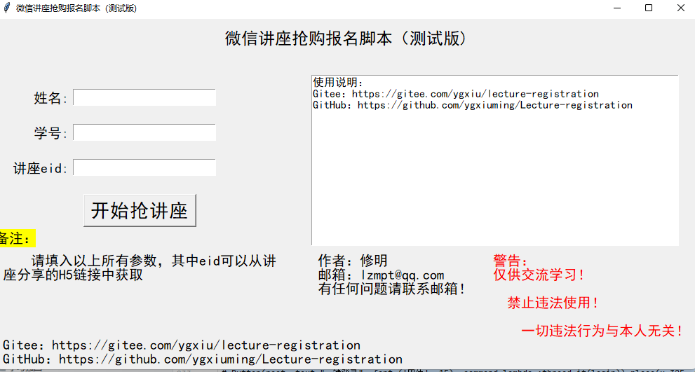
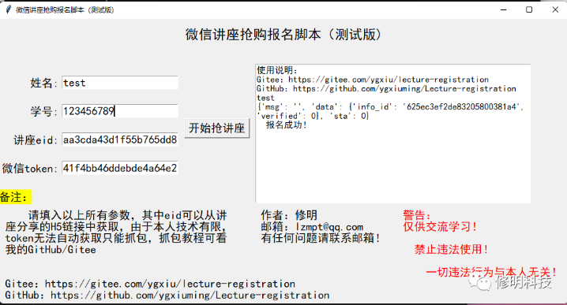
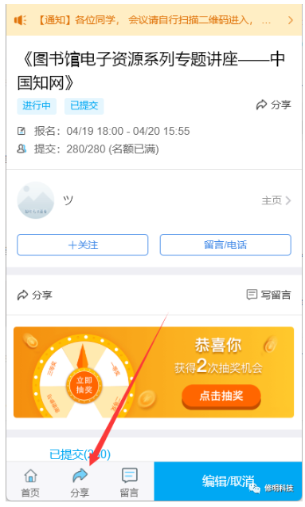
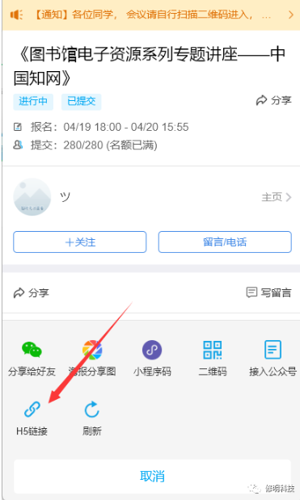
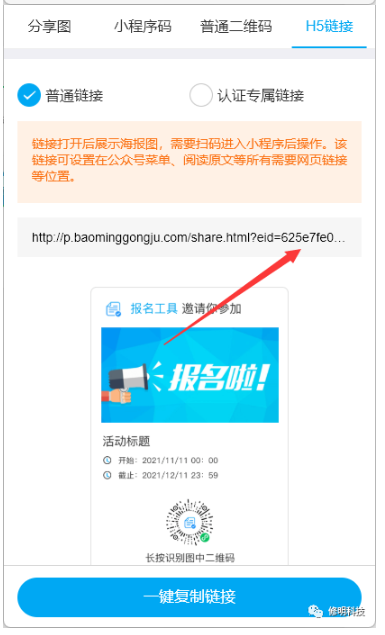

# Lecture-registration

微信小程序报名工具进行抢购讲座报名脚本

# 微信小程序“报名工具”抢报名脚本

---

## 环境：

~~~
windows环境
~~~

## GUI界面

## 使用方法

### step1 配置相关设置

首先需要配置好姓名，学号，在程序相关注释上有说明

其次配置所需抢报名的讲座eid

### step2 运行

默认设置了每一秒提交一次服务器（时间过快容易导致服务器繁忙）

## EID

打开对应小程序讲座页面

点击分享，然后点击H5链接即可看到对应的eid

！！！注意：eid不是网址，是网址后面那一串。
例如网址为：http://p.baominggongju.com/share.html?eid=635a00aa52f3d452c56bd09d
则他对应的eid为：635a00aa52f3d452c56bd09d

注：仅供交流学习，禁止违法使用，一切违法行为与本人无关！！！

GUI打包程序下载地址：
## 老版本需要自己抓取token
https://wwd.lanzoum.com/b01pc53qd
密码:asv5

## 新版本，自动登录，无需抓包，扫码即可.
https://wwd.lanzoum.com/b01pvee8j
密码：8888

支持定做脚本！！！

有问题联系邮箱lzmpt@qq.com

