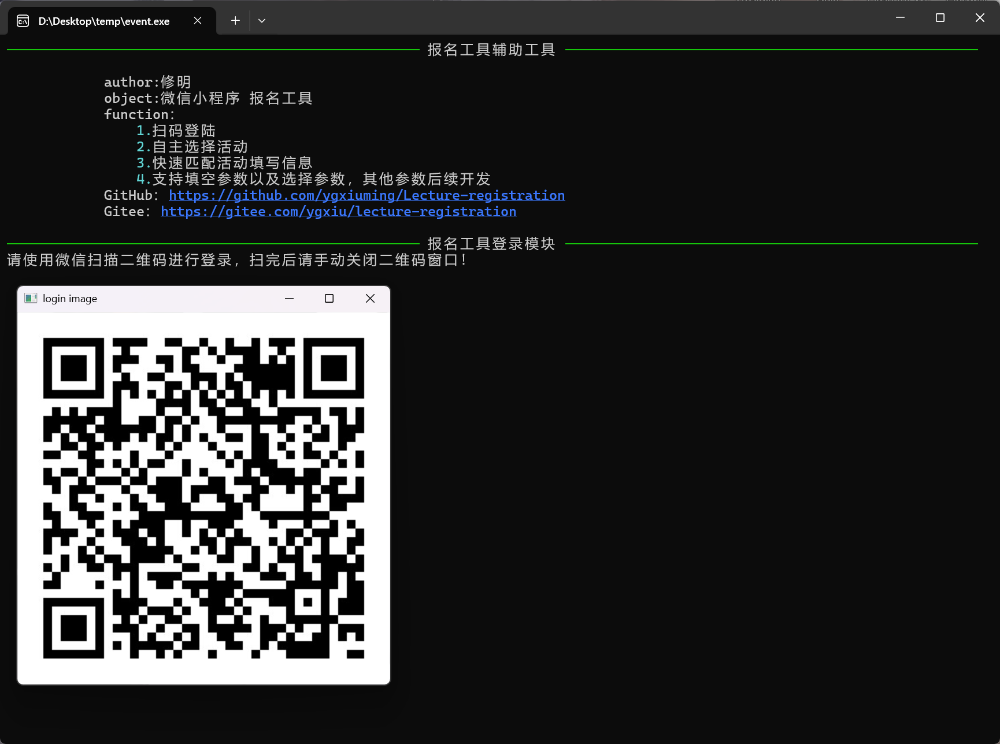
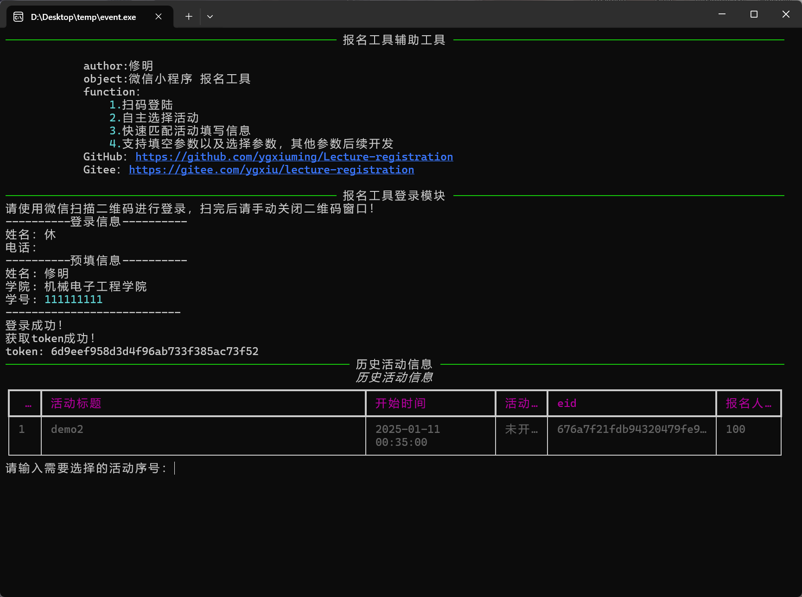
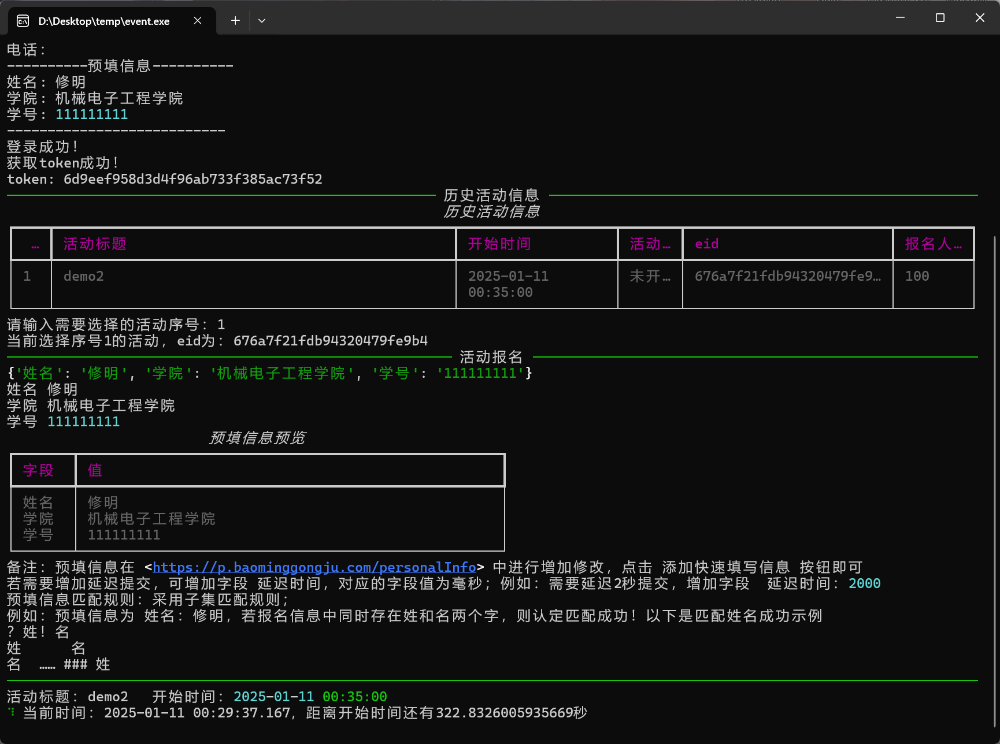
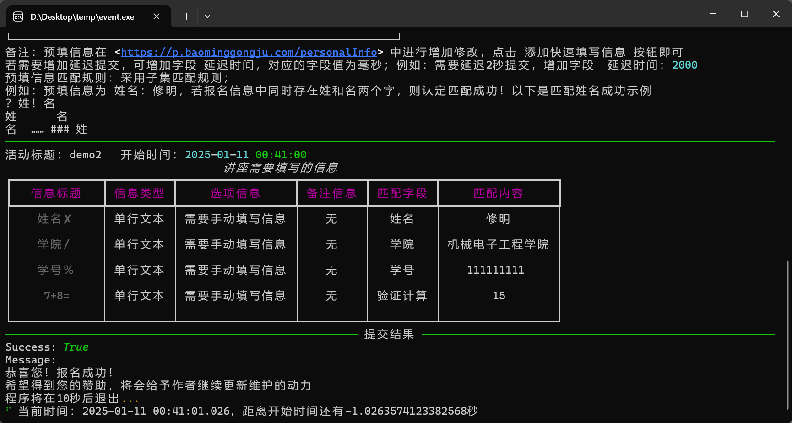

# Lecture-registration

微信小程序报名工具进行抢购讲座报名脚本


# 微信小程序“报名工具”抢报名脚本

---


## 环境：

~~~
python==3.9.7
opencv-python==4.6.0.66
requests==2.28.1
rich==12.6.0
~~~

## 更新日志

- 2025-10-12  修复了加密算法错误
- 2025-10-12  网页token提交表单失效，现在需要获取小程序token进行提交

## 功能：
- 支持微信扫码登陆
- 支持自主选择活动
- 支持输出所需要填写的所有信息及条件
- 支持预填信息
- 预填信息采用子集匹配

## 说明介绍：
###  预填信息使用方法

- 使用微信小程序填写
  - 进入微信小程序
  - 点击个人中心
  - 点击头像旁边的 **修改** 按钮 
  - 点击最下方的**添加快速填写信息** 即可
  - 名称为需要匹配字段，内容为你想填写的内容
- 网页填写
  - 网址：https://p.baominggongju.com/personalInfo
  - 手机扫码登录即可
  - 点击最下方的**添加快速填写信息** 即可
  - 名称为需要匹配字段，内容为你想填写的内容

####  匹配规则

预填信息匹配规则：采用子集匹配规则；
例如：预填信息为 姓名：修明，若报名信息中同时存在姓和名两个字，则认定匹配成功！

以下是匹配姓名成功示例

- ？姓！名
- 姓      名
- 名  …… ### 姓

以上字段都将匹配姓名字段，匹配内容为姓名的内容（此处为修明）

若需要延迟提交，请在预填写字段处新增字段，名称为 延迟时间，内容为延迟的时间，单位为毫秒，例如延迟2秒，则内容填写2000即可

---

###  使用说明

首先，你需要拿到讲座信息使用你的微信点进去一次，此时你的微信将会记录本次讲座，运行该程序

执行 `python main.py` 或者点击打包版exe文件运行即可


### 文件结构

```
Lecture-registration/
├── main.py                          # 原有文件 (保持不变)
├── main_refactored.py               # 重构后的主文件
├── requirements.txt                 # 依赖文件 (已更新)
├── .env.example                     # 配置示例 (新增)
├── .gitignore                       # Git忽略文件 (新增)
├── CLAUDE.md                        # 项目文档 (已创建)
├── REFACTORING_SUMMARY.md          # 本文件
├── test_refactored.py              # 单元测试 (新增)
│
├── utils/                           # 工具模块 (新增)
│   ├── __init__.py
│   ├── constants.py                # 常量定义
│   ├── validators.py               # 数据验证
│   ├── security.py                 # 安全认证
│   ├── api_client.py               # API客户端
│   └── formatters.py               # 数据格式化
│
└── services/                        # 业务服务 (新增)
    ├── __init__.py
    ├── auth_service.py             # 认证服务
    └── lecture_service.py          # 活动服务
```

### 核心改进

1. **模块化设计**: 将功能分解为独立的模块，每个模块职责单一
2. **面向对象**: 使用类封装API客户端和服务层
3. **类型注解**: 为所有函数添加类型提示
4. **日志记录**: 使用 Python logging 模块
5. **安全增强**: 启用SSL验证，移除eval()
6. **配置管理**: 使用常量文件管理配置
7. **测试支持**: 添加单元测试验证功能

## 运行方式

### 原有方式 (保持不变)
```bash
python main.py
```

### 重构方式 (推荐)
```bash
# 先安装新依赖
pip install -r requirements.txt

# 运行重构版本
python main_refactored.py

# 运行测试
python test_refactored.py
```


## 程序执行快看

### 登录功能


### 讲座选择以及讲座信息输出



### 抢讲座！！！

### 抢讲座成功



支持定做脚本！！！

## 

## 最后的最后，可以给我一个star吗？万分感谢！


## 如果本仓库对你有帮助，欢迎扫描下面二维码给我赞赏


## &#8627; Stargazers

[](https://github.com/ygxiuming/Lecture-registration/stargazers)

## &#8627; Forkers

[](https://github.com/ygxiuming/Lecture-registration/network/members)


