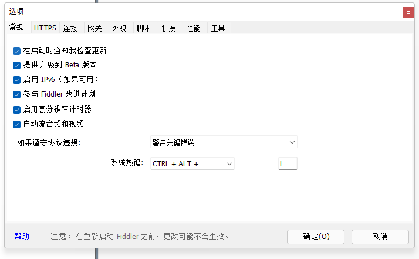
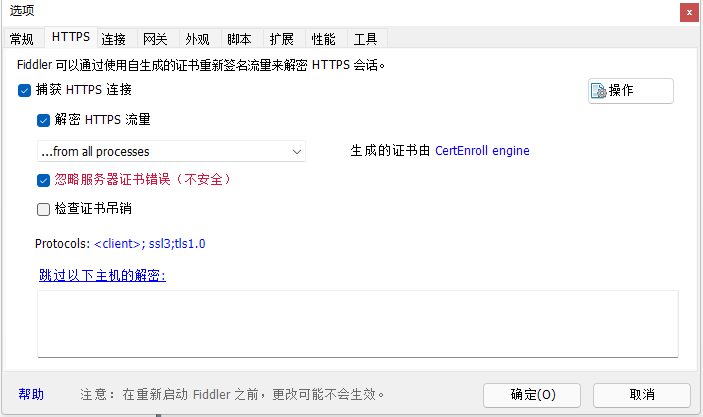
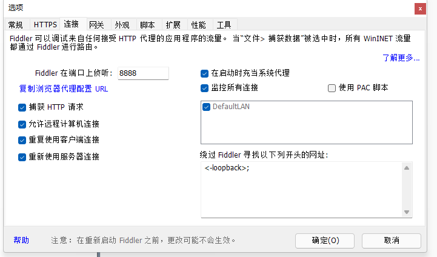
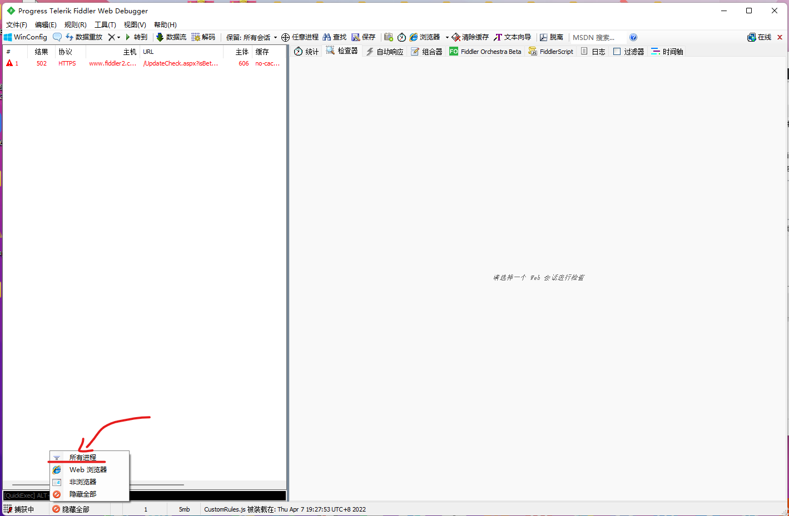
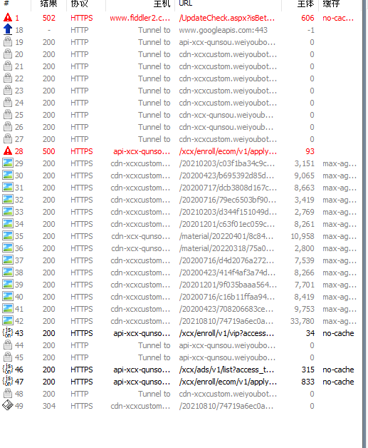
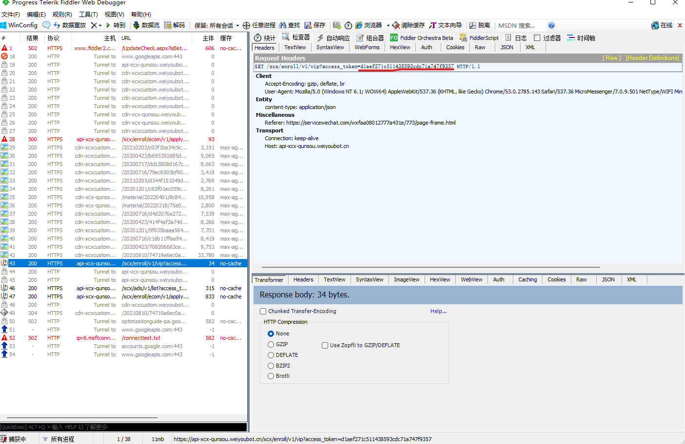

# Lecture-registration

微信小程序报名工具进行抢购讲座报名脚本

# 微信小程序“报名工具”抢报名脚本

---

## 环境：

~~~
python  #3.5版本以上
requests  #安装方式：pip install requests
json
time
~~~

## 使用方法

### step1 配置相关设置

首先需要配置好姓名，学号，在程序相关注释上有说明

其次配置所需抢报名的讲座eid和自己微信相关的token

### step2 运行

默认设置了每一秒提交一次服务器（时间过快容易导致服务器繁忙）

# 配置操作

所需要电脑上安装<u>[微信](https://weixin.qq.com/)</u>最新版以及f抓包工具<u>[Fiddler](「Fiddler 中文版.exe」https://www.aliyundrive.com/s/uiZRd9tZm7G)</u>.

### 首先获取token

电脑打开上面提供的Fiddler

并且点开工具->选项

### 开始抓包

1.打开抓包按钮

2.微信进入小程序 报名工具

3.随便点击api即可，我这里点击第43行

这个即是你的token，填入代码对应位置即可

## EID

打开对应小程序讲座页面

点击分享，然后点击H5链接即可看到对应的eid

有问题联系邮箱lzmpt@qq.com

