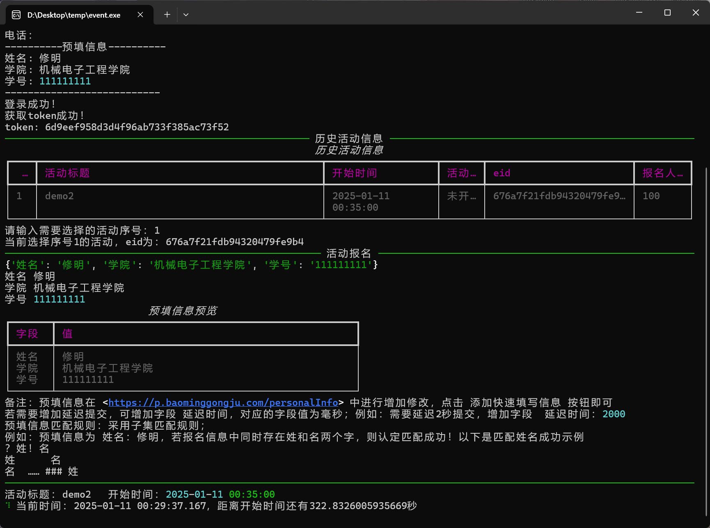

# Lecture-registration

微信小程序报名工具进行抢购讲座报名脚本

# 微信小程序“报名工具”抢报名脚本

---

## 环境：

~~~
python==3.9.7
opencv-python==4.6.0.66
requests==2.28.1
rich==12.6.0
~~~

## 功能：
- 支持微信扫码登陆
- 支持自主选择活动
- 支持输出所需要填写的所有信息及条件
- 支持预填信息
- 预填信息采用子集匹配

## 说明介绍：
###  预填信息使用方法

- 使用微信小程序填写
  - 进入微信小程序
  - 点击个人中心
  - 点击头像旁边的 **修改** 按钮 
  - 点击最下方的**添加快速填写信息** 即可
  - 名称为需要匹配字段，内容为你想填写的内容
- 网页填写
  - 网址：https://p.baominggongju.com/personalInfo
  - 手机扫码登录即可
  - 点击最下方的**添加快速填写信息** 即可
  - 名称为需要匹配字段，内容为你想填写的内容

####  匹配规则

预填信息匹配规则：采用子集匹配规则；
例如：预填信息为 姓名：修明，若报名信息中同时存在姓和名两个字，则认定匹配成功！

以下是匹配姓名成功示例

- ？姓！名
- 姓      名
- 名  …… ### 姓

以上字段都将匹配姓名字段，匹配内容为姓名的内容（此处为修明）

若需要延迟提交，请在预填写字段处新增字段，名称为 延迟时间，内容为延迟的时间，单位为毫秒，例如延迟2秒，则内容填写2000即可

---

###  使用说明

首先，你需要拿到讲座信息使用你的微信点进去一次，此时你的微信将会记录本次讲座，运行该程序

执行 `python main.py` 或者点击打包版exe文件运行即可

## 程序执行快看

### 登录功能

### 讲座选择以及讲座信息输出

### 抢讲座！！！

### 抢讲座成功

支持定做脚本！！！

## 

## 最后的最后，可以给我一个star吗？万分感谢！

## 如果本仓库对你有帮助，欢迎扫描下面二维码给我赞赏

## &#8627; Stargazers

## &#8627; Forkers

